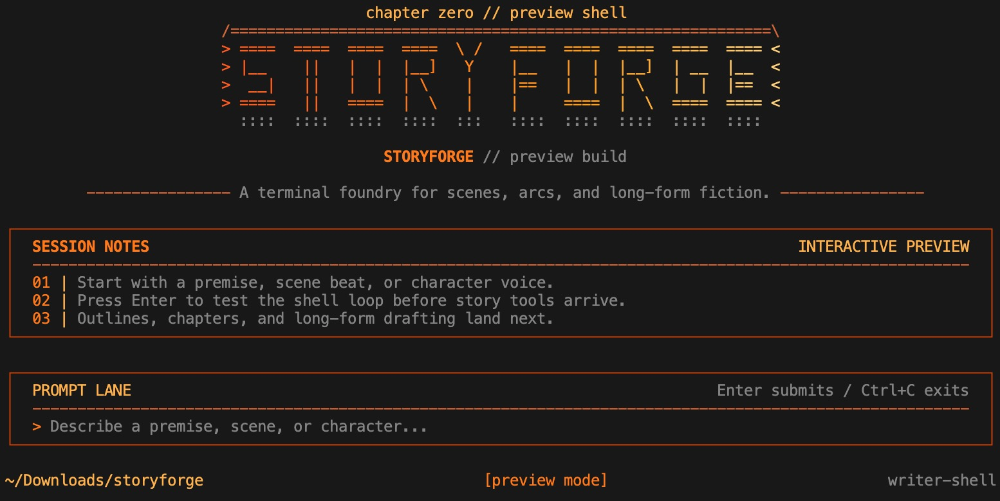

# Storyforge Complete Beginner Guide (Install To Finished Novel)

**English** | [中文](./README.zh-CN.md)

This guide is for first-time Storyforge users.

Goal: start from installation and end with one full compiled novel manuscript.

API references:

- [HTTP API (English)](./api.md)
- [HTTP API（中文）](./api_zh.md)



## What You Will Get

- A practical, repeatable writing workflow
- A clear command order from start to finish
- A full path from install to `story.md`
- Troubleshooting steps for common beginner issues

## 0. How Storyforge Works

Storyforge is not a single "generate everything" prompt tool. It is a staged workflow:

1. Build structured story state (`world`, `characters`, `timeline`, `outline`)
2. Commit chapter events (`/commit`)
3. Run narrative CI checks (`/ci run`)
4. Render chapter prose (`/render`)
5. Compile a full manuscript (`/compile all`)

This structure is very beginner-friendly because you can inspect and edit each layer.

## 1. Installation

## 1.1 macOS (Recommended: DMG From Releases)

Download:

- Releases page: `https://github.com/Picrew/storyforge-cli/releases`
- Select your version (for example `v0.1.1`)
- Download `storyforge-<version>-macos-universal.dmg`

Install:

1. Open the `.dmg`
2. Run the `.pkg` installer inside
3. Finish the installer flow
4. Open terminal and run:

```bash
storyforge
```

If you see `command not found`, check:

```bash
ls -l /usr/local/bin/storyforge
```

If it exists but still fails, add `/usr/local/bin` to PATH and reopen terminal:

```bash
echo 'export PATH="/usr/local/bin:$PATH"' >> ~/.zshrc
source ~/.zshrc
```

## 1.2 Linux (Current Release Format: tar.gz Runtime Package)

Linux asset currently shipped:

- `storyforge-<version>-linux-universal.tar.gz`

Install example:

```bash
tar -xzf storyforge-0.1.1-linux-universal.tar.gz
cd storyforge-0.1.1-linux-universal
sudo mkdir -p /usr/local/lib/storyforge
sudo cp -R ./lib/storyforge/. /usr/local/lib/storyforge/
sudo install -m 0755 ./bin/storyforge /usr/local/bin/storyforge
storyforge
```

## 1.3 From Source (Developer Mode)

```bash
pnpm install
pnpm dev
```

If your environment blocks `tsx` runtime sockets, run the compiled build:

```bash
pnpm build
node packages/cli/dist/index.js
```

## 2. Runtime Requirements

For packaged installs (`.pkg` / `.dmg` / `tar.gz`), Storyforge includes a bundled Node runtime.
You only need:

- Python 3.10+
- `opencode` in PATH

Verify:

```bash
python3 --version
opencode --version
```

If you run from source (`pnpm dev`, `pnpm build`), Node.js 20+ is still required.

## 3. The 8 Working Modes For Beginners

## Mode 1: Connection

Purpose: connect provider and model.

Common commands:

- `/connect`
- `/models`
- `/model <provider/model>`

## Mode 2: Project Bootstrap

Purpose: create project and feed the story brief.

Common commands:

- `/init` — create project in the current directory
- `/init --dir ~/novels/my-story` — create project in a custom directory (absolute or relative path, auto-created if missing)

After `/init`, the next normal input becomes your brief. When `--dir` is used, all subsequent commands (`/commit`, `/render`, `/compile`, etc.) operate in that directory for the session.

## Mode 3: Structure Editing

Purpose: fix story setup before drafting.

Common commands:

- `/world`
- `/char`
- `/timeline`
- `/outline`

## Mode 4: Event Commit

Purpose: record chapter-level canonical events.

Common command:

- `/commit --chapter chNN` — uses the outline summary as default event description
- `/commit --chapter chNN <event_text>` — uses custom event text

Chapter id must be in `ch01`, `ch02` format. When no event text is provided, the chapter's outline (summary + purpose + hook) is used automatically.

## Mode 5: Quality / Consistency Check

Purpose: detect continuity issues.

Common commands:

- `/ci run`
- `/status`
- `/log`

## Mode 6: Chapter Render

Purpose: generate prose markdown from current state.

Common commands:

- `/render chNN`
- `/render ch01..ch08`
- `/render all`

## Mode 7: Manuscript Compile

Purpose: merge chapters into one novel file.

Common commands:

- `/compile all`
- `/compile ch01..ch08 --output ./.storyforge/manuscript/final.md`

## Mode 8: Free Prompt Mode

Purpose: ask for ideas, rewrites, scene help outside slash commands.

Use normal text input and press Enter.

## 4. End-To-End Walkthrough (From Zero To Full Novel)

Use this sequence directly.

## Step 1: Launch And Connect

```text
storyforge
/connect
/models
```

One-line connection example (OpenRouter):

```text
/connect openrouter <api-key>
/model openrouter/stepfun/step-3.5-flash:free
```

## Step 2: Initialize Project And Provide Brief

```text
/init
/init --dir ~/novels/my-story   # optional: specify project directory
```

Then input a normal brief text, for example:

```text
Write an 8-chapter Chinese sci-fi mystery novel. The protagonist Lin Che is a memory-restoration specialist in near-future Shanghai, investigating a chain of “deleted childhood” cases. Keep tone restrained and realistic, with strict causality and emotional progression.
```

## Step 3: Review Core Tables

```text
/world
/char
/timeline
/outline
```

Edit anything that is off. Example:

```text
/world set premise Near-future Shanghai where memory restoration is a grey industry
/char add Lin Che
/char set 1 role Protagonist
/timeline add Lin Che receives the first "blank childhood" case
/outline set 1 title The Blank Album
```

## Step 4: Repeat The Core Chapter Loop

For each chapter:

1. Commit a key event
2. Run CI
3. Render prose

Chapter 1 example (uses outline summary automatically):

```text
/commit --chapter ch01
/ci run
/render ch01
```

Or with custom event text:

```text
/commit --chapter ch01 Lin Che finds a blurred silhouette in the client's old photos and decides to trace the original film source
/ci run
/render ch01
```

Chapter 2 example:

```text
/commit --chapter ch02
/ci run
/render ch02
```

If CI fails, avoid `--force` first. Fix structure or event logic, then recommit.

## Step 5: Batch Render Remaining Chapters

After finishing `ch01..ch08` event commits:

```text
/render ch01..ch08
```

Full rerender when needed:

```text
/render all --force
```

## Step 6: Compile Final Manuscript

```text
/compile all
```

Default output:

- `./.storyforge/manuscript/story.md`

Now you have a completed full manuscript.

## 5. Where Files Are Saved

In your current working directory, Storyforge creates `.storyforge/`:

- `./.storyforge/workspace.json`: workspace index
- `./.storyforge/projects/`: structured project states
- `./.storyforge/chapters/chNN.md`: rendered chapters
- `./.storyforge/manuscript/story.md`: compiled full novel

Recommendation: use one directory per novel project.

## 6. Common Beginner Questions

## Q1: Why is my first text after `/init` consumed?

Expected behavior. That first normal message is used as the story brief.

## Q2: `/commit` failed CI. What now?

Run:

```text
/status
/log --chapter chNN
```

Then fix world/character/timeline state and recommit.

## Q3: Can I bypass CI?

Yes:

```text
/commit --chapter chNN <event> --force
```

Use sparingly. Long-term continuity will degrade.

## Q4: What if `opencode` is missing?

Model lists may fall back to built-in catalog and generation can be limited. Install `opencode` and verify `opencode --version`.

## 7. Recommended Pace For New Users

1. Start with a 4-chapter pilot project
2. Move to 8-12 chapters after first success
3. Keep chapter loop strict: `commit -> ci -> render`
4. Run `/compile` every 2-3 chapters for pacing checks
5. Before release draft, run `/render all --force` then `/compile all`

## 8. Related Docs

- [Quickstart](./quickstart.md)
- [Provider And Model Setup](./provider-and-model-setup.md)
- [Feature Overview](./feature-overview.md)
- [Command Reference](./command-reference.md)
- [Bash Workflow And Architecture](./bash-architecture.md)
- [Story Writing Quality Playbook](./story-writing-quality-playbook.md)
- [Troubleshooting](./troubleshooting.md)
