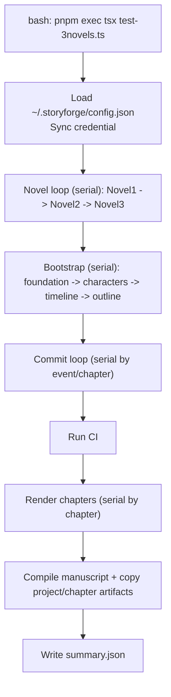
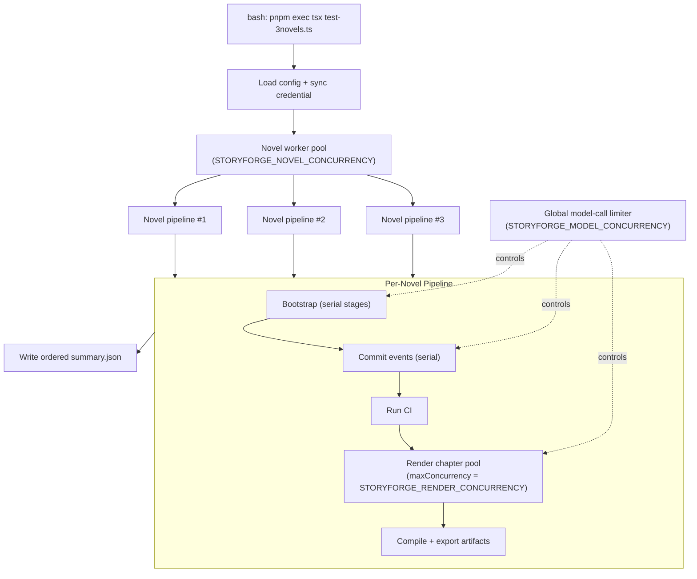

# Bash Workflow And Architecture (3-Novel Run)

This document focuses on the command-line batch pipeline used by `test-3novels.ts`.

## Feature Map

| Capability | CLI Command / Script | Core Module | Output |
| --- | --- | --- | --- |
| Initialize story project and bootstrap tables | `/init` (interactive) or `runStoryTask` in `test-3novels.ts` | `packages/cli/src/story/bootstrap.ts` | `world`, `characters`, `timeline`, `outline` in project state |
| Event-to-state patching | `/commit --chapter chNN <event>` | `packages/cli/src/story/simulation.ts` + `packages/cli/story_agent.py` | Updated world-state + commit history |
| Deterministic CI checks | `/ci run` | `packages/cli/src/story/simulation.ts` + `packages/cli/story_agent.py` | CI report (`ciHistory`) |
| Chapter rendering | `/render` or `renderStoryChapters` in `test-3novels.ts` | `packages/cli/src/story/simulation.ts` | `.storyforge/chapters/chNN.md` |
| Manuscript compilation | `/compile` or `compileStoryChapters` in `test-3novels.ts` | `packages/cli/src/story/simulation.ts` | `.storyforge/manuscript/story.md` or custom output |
| Batch 3-novel generation | `pnpm exec tsx test-3novels.ts` | `test-3novels.ts` | `generated-novels/<timestamp>/...` |

## Current Serial Flow (Before Optimization)



## Optimized Flow (Now Implemented)



## Bash Knobs

Use these environment variables to tune throughput safely:

```bash
STORYFORGE_NOVEL_CONCURRENCY=2 \
STORYFORGE_MODEL_CONCURRENCY=2 \
STORYFORGE_RENDER_CONCURRENCY=2 \
pnpm exec tsx test-3novels.ts
```

Practical defaults:

- `STORYFORGE_NOVEL_CONCURRENCY=2`: two novels in flight.
- `STORYFORGE_MODEL_CONCURRENCY=2`: global guardrail for model calls.
- `STORYFORGE_RENDER_CONCURRENCY=2`: per-novel chapter render parallelism.

If your provider starts rate-limiting or timing out, lower `STORYFORGE_MODEL_CONCURRENCY` first.
